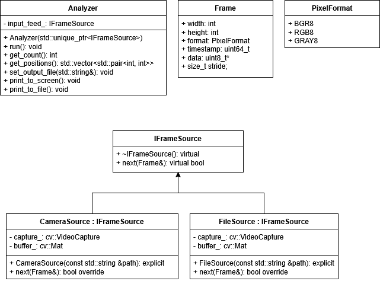

# ACME_perception_module
[](https://opensource.org/licenses/MIT)
&nbsp;&nbsp;&nbsp;&nbsp;
 
&nbsp;&nbsp;&nbsp;&nbsp;
[](https://codecov.io/gh/GraysonGilbert/ACME_perception_module)

## Table of Contents
- [Overview](#overview)
- [Personnel](#personnel)
- [License](#license)
- [Project Deliverables](#project-deliverables)
- [Features](#features)
- [Architecture](#architecture)
- [Developer Documentation](#developer-documentation)
- [Dependencies](#dependencies)
- [Installation](#installation)
- [Testing](#testing)

## Overview
This repository is the midterm assignment for the ENPM700 Software Development couse. The following project is a perception module for ACME Robotics. This C++ module will be a human (N>=1) obstacle detector and tracker. It will output location data obtained from analyzing video from a monocular video camera.


  

## Personnel

**Grayson Gilbert** - I am a full time Mechanical Engineer currently pursuing a M.Eng in Robotics from the University of Maryland, College Park. I have a broad background in hardware and software, and I am interested in working with embedded systems.

**Marcus Hurt** - [Insert personal statement here.]

## License

This project is licensed under the **MIT License** – see the [LICENSE](LICENSE) file for details.

## AIP Related Documents

- **[Proposal](https://docs.google.com/document/d/1lg7BTjVZPU-9VlcfBjtMoFnfqaxiJw49ybgWXe28exQ/edit?usp=sharing)** 
- **[Quad Chart](https://docs.google.com/presentation/d/1ArSuv_W5K5M3QDWWErcLwr7SC7UwhioL13dkYcQ4VEk/edit?usp=sharing)** 
- **[Product Backlog](https://docs.google.com/spreadsheets/d/1AJOp31G0ja_eymtNH2MVXDXD4VEDos6vJx1aDn5YIA0/edit?usp=sharing)**

## Developer Documentation

### Dependencies

### Known Bugs/Issues

### How to Build Project
```bash
build procedures go here.
```


### How to Run Demo

### How to Run Tests

### How to Generate Doxygen Docs


## Project Deliverables
### **Phase 0**
| **Deliverable**      | **Link** |
|:---------------------|:-------- |
| **Proposal**         | **[Link](https://docs.google.com/document/d/1lg7BTjVZPU-9VlcfBjtMoFnfqaxiJw49ybgWXe28exQ/edit?usp=sharing)** |
| **Quad Chart**       | **[Link](https://docs.google.com/presentation/d/1ArSuv_W5K5M3QDWWErcLwr7SC7UwhioL13dkYcQ4VEk/edit?usp=sharing)** |
| **Proposal Video**   | **[Link](https://youtu.be/OkT_tCYltAI?si=i8uGd-1u-vzNCljR)** |
| **Product Backlog**  | **[Link](https://docs.google.com/spreadsheets/d/1AJOp31G0ja_eymtNH2MVXDXD4VEDos6vJx1aDn5YIA0/edit?usp=sharing)** | 
| **UML Class Diagram**| **[Link](https://drive.google.com/file/d/1UlZO1RhkXP9v4lFadjrH4jGhcDqJkhok/view?usp=sharing)**|


### **Phase 1**


### **Phase 2**